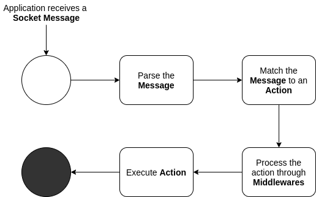
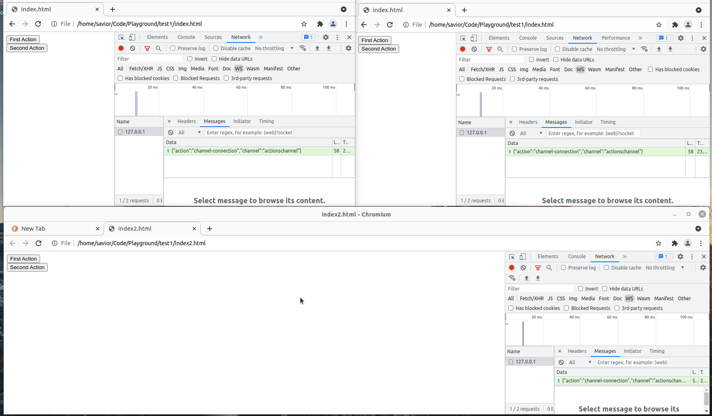

<p align="center">

</p>


[](https://scrutinizer-ci.com/code-intelligence)
[](https://scrutinizer-ci.com/g/kanata-php/socket-conveyor/?branch=master)

> A WebSocket/Socket message Router for PHP

### 🏠 [Homepage](https://github.com/kanata-php/socket-conveyor)

## Prerequisites

- PHP >= 8.0

## Installation

```shell
composer require kanata-php/socket-conveyor
```

## Description

This package enables you to work with socket messages with routes strategy. For that, you just add an Action Handler implementing the `ActionInterface` to the `SocketMessageRouter` and watch the magic happen!

This package assumes that the application is receiving socket messages with a socket server. As an example of how to accomplish that with PHP, you can use the [OpenSwoole](https://openswoole.com/).


## How it works

The main example is set in the `tests ` directory, but here is how it works:





## Usage

### Simple Use

At this library, there is the presumption that the socket message has a *JSON* format. That said, the following standard is expected to be followed by the messages, so they can match specific *Actions*. The minimum format is this:

```json
{
    "action": "sample-action",
    "other-parameters": "here goes other fields necessary for the Actions processing..."
}
```

It can be used in any WebSocket library. Following we have a basic example in [OpenSwoole](https://openswoole.com):

First, write some actions:

```php
require __DIR__.'/vendor/autoload.php';

use Conveyor\Actions\Abstractions\AbstractAction;

class ExampleFirstCreateAction extends AbstractAction
{
    protected string $name = 'example-first-action';
    public function execute(array $data)
    {
        $this->send('Example First Action Executed!');
    }
    public function validateData(array $data) : void {}
}

class ExampleSecondCreateAction extends AbstractAction
{
    protected string $name = 'example-second-action';
    public function execute(array $data)
    {
        $this->send('Example Second Action Executed!');
    }
    public function validateData(array $data) : void {}
}
```

Second, at your Open Swoole Web Socket server, register `SocketMessageRouter` with your actions at your `OnMessage` event handler:

```php
require __DIR__.'/vendor/autoload.php';

use Swoole\WebSocket\Frame;
use Swoole\WebSocket\Server;
use Conveyor\SocketHandlers\SocketMessageRouter;

$websocket = new Server('0.0.0.0', 8001);
$websocket->on('message', function (Server $server, Frame $frame) {
    echo 'Received message (' . $frame->fd . '): ' . $frame->data . PHP_EOL;
    $socketRouter = new SocketMessageRouter;
    $socketRouter->add(new ExampleFirstCreateAction);
    $socketRouter->add(new ExampleSecondCreateAction);
    $socketRouter($frame->data, $frame->fd, $server);
});

$websocket->start();
```

Thats it! Now, to communicate in real-time with this service, on your HTML you can do something like this:

```html
<div>
    <div><button onclick="sendMessage('example-first-action', 'first')">First Action</button></div>
    <div><button onclick="sendMessage('example-second-action', 'second')">Second Action</button></div>
    <div id="output"></div>
</div>
<script type="text/javascript">
    var websocket = new WebSocket('ws://127.0.0.1:8001');
    websocket.onmessage = function (evt) {
        document.getElementById('output').innerHTML = evt.data;
    };
    function sendMessage(action, message) {
        websocket.send(JSON.stringify({
            'action': action,
            'params': {'content': message}
        }));
    }
</script>
```

How it looks like:


### Using Channels

The procedure here requires one extra step during the instantiation: the connection action. The connection action will link in a persistent manner the connection FD to a channel.

```json
{
    "action": "channel-connection",
    "channel": "channel-name"
}
```

The Actions can be the same as the simple example. The Server initialization (remembering that this example is for OpenSwoole) will be a little different:

To begin with, the actions, when calling for the method "send" will consider the third parameter to point out that they are sending a message to the entire channel, e.g.:

```php
class ExampleFirstCreateAction extends AbstractAction
{
    protected string $name = 'example-first-action';
    public function execute(array $data): mixed
    {
        // This method will broadcast message to the entire channel
        // if we set the third parameter (toChannel) to true.
        $this->send('Example First Action Executed!', null, true);
        return null;
    }
    public function validateData(array $data) : void {}
}
```

The Socker Router instantiation also suffers a small change, so 

```php
require __DIR__.'/vendor/autoload.php';

use Swoole\WebSocket\Frame;
use Swoole\WebSocket\Server;
use Conveyor\SocketHandlers\SocketMessageRouter;

$persistenceService = new SocketChannelsTable; // this is an example of the PersistenceInterface that needs to be set so the Socket Router knows how to persist its data.
$websocket = new Server('0.0.0.0', 8001);
$websocket->on('message', function (Server $server, Frame $frame) use ($persistenceService) {
    echo 'Received message (' . $frame->fd . '): ' . $frame->data . PHP_EOL;
    $socketRouter = new SocketMessageRouter($persistenceService);
    
    // This makes it possible for the router to accept connections to channels.
    $socketRouter->add(new ChannelConnectionAction);
    
    $socketRouter->add(new ExampleFirstCreateAction);
    $socketRouter->add(new ExampleSecondCreateAction);
    $socketRouter($frame->data, $frame->fd, $server);
});

$websocket->start();
```

An example of the `Conveyor\Actions\Interfaces\PersistenceInterface` for the persistence of the channels information is the following. Notice that this example uses `Swoole\Table`, but it can use any external persistent storage behing the interface.

```php
use Conveyor\Actions\Interfaces\PersistenceInterface;
use Swoole\Table;

class SocketChannelsTable implements PersistenceInterface
{
    protected Table $table;

    public function __construct()
    {
        $this->table = new Table(10024);
        $this->table->column('channel', Table::TYPE_STRING, 40);
        $this->table->create();
    }

    public function connect(int $fd, string $channel): void
    {
        $this->table->set($fd, ['channel' => $channel]);
    }

    public function disconnect(int $fd): void
    {
        $this->table->del($fd);
    }

    public function getAllConnections(): array
    {
        $collection = [];
        foreach($this->table as $key => $value) {
            $collection[$key] = $value['channel'];
        }
        return $collection;
    }
}
```

With these changes to the server, you can have different implementations on the client-side. Each implementation, in a different context, connects to a different channel. As an example, we have the following HTML example. When connected, it will make sure the current connection belongs to a given channel. To connect another implementation to a different channel, you just need to use a different channel parameter.

```html
<div>
    <div><button onclick="sendMessage('example-first-action', 'first')">First Action</button></div>
    <div><button onclick="sendMessage('example-second-action', 'second')">Second Action</button></div>
    <div id="output"></div>
</div>
<script type="text/javascript">
    var channel = 'actionschannel';
    var websocket = new WebSocket('ws://127.0.0.1:8001');
    websocket.onopen = function(e) {
        websocket.send(JSON.stringify({
            'action': 'channel-connection',
            'channel': channel,
        }));
    };
    websocket.onmessage = function (evt) {
        document.getElementById('output').innerHTML = evt.data;
    };
    function sendMessage(action, message) {
        websocket.send(JSON.stringify({
            'action': action,
            'params': {'content': message}
        }));
    }
</script>
```

That's all, with this, you would have the following:



## Tests

Run Command:

```shell
./vendor/bin/phpunit
```

## Author

👤 **Savio Resende**

* Website: https://savioresende.com
* GitHub: [@lotharthesavior](https://github.com/lotharthesavior)

## 📝 License

Copyright © 2022 [Savio Resende](https://github.com/lotharthesavior).

This project is [MIT](https://github.com/kefranabg/readme-md-generator/blob/master/LICENSE) licensed.
